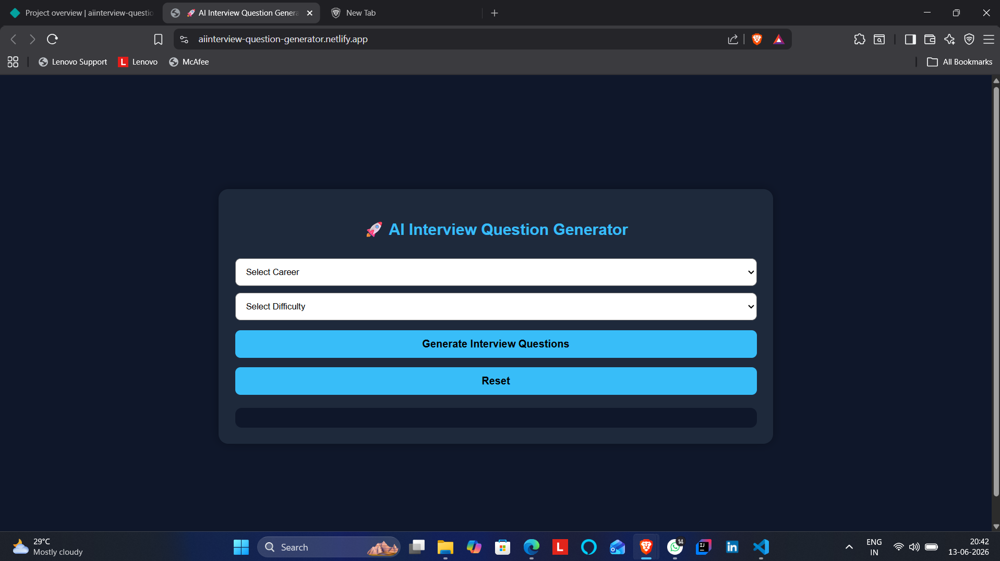
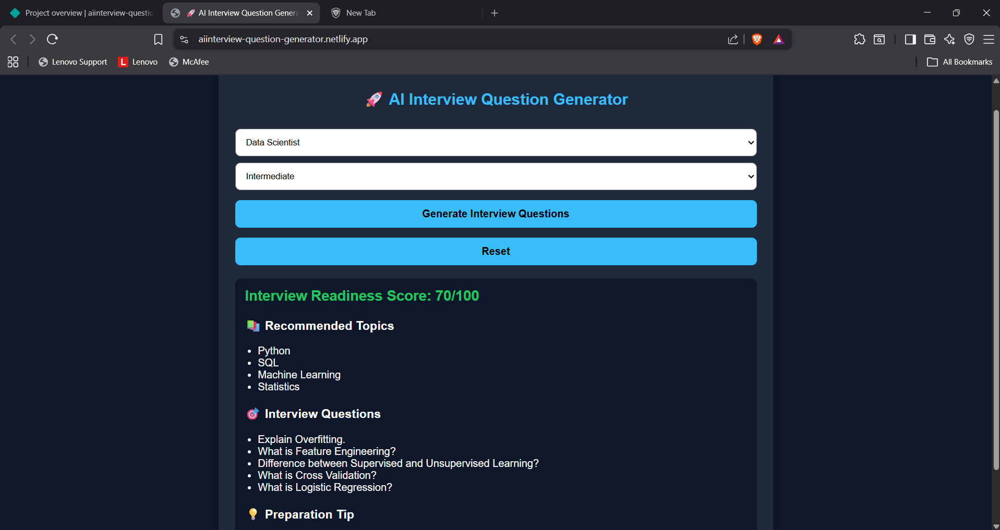

# AI Interview Question Generator

🚀 Day 5 of my 30 Days 30 AI Websites Challenge

AI Interview Question Generator is a simple web application that helps students and job seekers prepare for interviews by generating role-based and difficulty-based interview questions.

The application provides interview readiness scores, recommended topics, interview questions, and preparation tips.

---

## 🌐 Live Demo

https://aiinterview-question-generator.netlify.app/

---

## 📸 Screenshots

---

## ✨ Features

- Career Selection
- Difficulty Selection
- Interview Readiness Score
- Recommended Topics
- Interview Questions Generation
- Preparation Tips
- Responsive UI
- AI-Assisted Development

---

## 🎯 Supported Career Paths

- Data Scientist
- Data Analyst
- AI Engineer
- Full Stack Developer
- Cyber Security Analyst

---

## 🛠 Technologies Used

- HTML
- CSS
- JavaScript
- AI-Assisted Development

---

## 📋 How It Works

1. Select a career path.
2. Select difficulty level.
3. Click Generate Interview Questions.
4. View:
   - Interview Readiness Score
   - Recommended Topics
   - Interview Questions
   - Preparation Tips

---

## 🚀 Example

Career:
Data Scientist

Difficulty:
Intermediate

Result:

Interview Readiness Score:
70/100

Topics:
- Python
- SQL
- Machine Learning
- Statistics

Questions:
- Explain Overfitting.
- What is Feature Engineering?
- Difference between Supervised and Unsupervised Learning?
- What is Cross Validation?
- What is Logistic Regression?

---

## 🎯 Challenge

This project is part of my 30 Days 30 AI Websites Challenge where I build and publish one AI-assisted website every day.

### Progress

- Day 1 ✅ AI Resume Analyzer
- Day 2 ✅ AI Career Roadmap Generator
- Day 3 ✅ AI Project Idea Generator
- Day 4 ✅ AI Skill Gap Analyzer
- Day 5 ✅ AI Interview Question Generator

---

## 👨‍💻 Author

Anand,

B.Tech CSE(Data Science)
